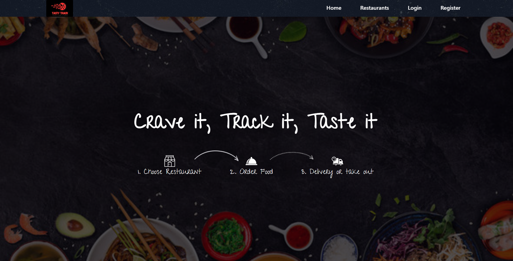

# 🍽️ FoodPicky - Online Food Ordering System

A modern, responsive, and user-friendly online food ordering system built with PHP, MySQL, HTML5, CSS3, and JavaScript. The system allows customers to browse restaurants, view menus, place orders, and track their delivery status.

## ✨ Features

### 👨‍💼 User Features
- User registration and authentication
- Browse restaurants by category
- View restaurant menus with images and descriptions
- Add items to cart
- Secure checkout process
- Order history and tracking
- User profile management

### 🏪 Restaurant Owner Features
- Restaurant profile management
- Menu management (add/edit/delete items)
- Order management
- Sales reports and analytics

### 👨‍💼 Admin Panel
- User management
- Restaurant management
- Category management
- Order management
- System configuration
- Sales and revenue reports

## 🛠️ Technologies Used

- **Frontend:** HTML5, CSS3, JavaScript, Bootstrap 4
- **Backend:** PHP 
- **Database:** MySQL
- **Server:** Apache
- **Payment Integration:** (Can be integrated with Razorpay/PayTM)

## 🚀 Installation Guide

### Prerequisites
- PHP 7.4 or higher
- MySQL 5.7 or higher
- Apache/Nginx web server
- Composer (for dependency management)

## 📍 Contact

For any queries or support, please contact:

- **Owner:** RIYA JALAN
- **Address:** Vaishnavi Rathnam, Jalahalli Cross, Bangalore - 560073, Karnataka, India
- **Email:** riyajalan@gmail.com
- **Phone:** +91 9956******

## 🌟 Features in Development

- [ ] Mobile app development
- [ ] Real-time order tracking
- [ ] Multiple payment gateway integration
- [ ] Loyalty program
- [ ] Review and rating system

## 📸 Screenshots
#HOME PAGE

#REGISTRATION PAGE

#LOGIN PAGE

